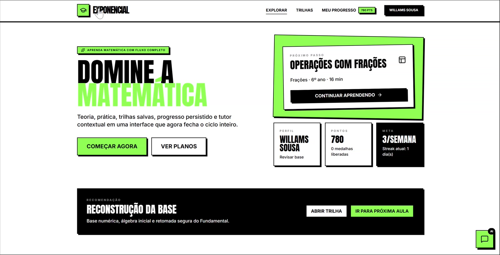

# Exponencial

Plataforma de estudos de matemática orientada a conteúdo. A meta do projeto é simples: o site deve se comportar como um **renderer** com trilhas, teoria, exercícios, gabaritos e progresso, enquanto o conteúdo curricular vem de arquivos declarativos e não de código espalhado pela UI.

## Prévia

<p align="center">
  <a href="docs/product/exponencial.mp4">
    
  </a>
</p>

Clique na imagem para abrir o vídeo de demonstração.

## Leitura rápida

- Arquitetura e limites do sistema: [docs/architecture.md](docs/architecture.md)
- Visão de produto e roadmap: [docs/product/vision-roadmap.md](docs/product/vision-roadmap.md)
- Especificação funcional: [docs/product/functional-spec.md](docs/product/functional-spec.md)
- Requisitos não funcionais: [docs/product/non-functional-requirements.md](docs/product/non-functional-requirements.md)
- Fluxo trunk-based e release: [docs/delivery/trunk-based-delivery.md](docs/delivery/trunk-based-delivery.md)
- Fluxo de autoria de conteúdo: [docs/content-authoring.md](docs/content-authoring.md)
- Instruções operacionais para IA e agentes: [AGENTS.md](AGENTS.md)

## Rodar localmente

Pré-requisito: Node.js.

```bash
npm install
npm run dev
```

Outros comandos úteis:

```bash
npm run content:scaffold
npm run content:generate
npm run lint
npm run test
npm run build
npm run validate
```

`npm run content:scaffold` usa a taxonomia canônica em `docs/estrutura/*` para criar apenas o que ainda não existir em `src/content/**`.

Com isso, o app já nasce com uma grade ampla representada. O que ainda não tiver teoria definitiva entra como placeholder em Markdown com status controlado.

Hoje, esse scaffold continua fazendo sentido como **bootstrap/backfill** da grade local em `src/content/**`. Ele não substitui a edição normal de conteúdo e não significa que o runtime remoto já esteja implantado.

## Modelo atual de conteúdo

Hoje o projeto já está orientado a conteúdo no fluxo curricular:

- tópicos e lições teóricas vivem em `src/content/**`
- exercícios e gabaritos vivem em arquivos `*.questions.md` ao lado das lições
- soluções passo a passo também podem viver no próprio `*.questions.md`
- a taxonomia curricular canônica vive em `docs/estrutura/*`
- tópicos e lições podem carregar `canonicalIds` para ligar o conteúdo à taxonomia
- os manifestos são gerados em `src/generated/content-manifest.ts`, `src/generated/lesson-content-index.ts` e `src/generated/question-index.ts`
- a geração também produz `src/generated/canonical-taxonomy.ts` e `src/generated/topic-taxonomy.ts`
- teoria e questões agora são carregadas por lição, sob demanda

Estado atual do repositório:

- o conteúdo canônico ainda vive versionado em `src/content/**`
- `npm run content:generate` transforma esse conteúdo em manifestos TypeScript consumidos pelo app no build
- o runtime remoto de conteúdo continua sendo arquitetura-alvo, não a implementação atual

Ou seja: teoria, exercícios e gabaritos entram no app por conteúdo declarativo. A UI continua responsável só por renderizar contratos estáveis e comportamentos do produto.

## Status de conteúdo

O app assume três estados curriculares:

- `outline`: estrutura pronta, ainda sem aula final
- `in-progress`: tópico ou lição em desenvolvimento
- `ready`: conteúdo pronto para uso

Isso existe para permitir que a grade inteira apareça no app, com filtros e agrupamentos funcionando, mesmo antes de todo o texto definitivo ser escrito.

Para validação de produto, não é obrigatório ter teoria final desde o início. O fluxo recomendado é:

1. validar a feature com conteúdo placeholder em Markdown
2. ajustar contrato, UX e regras de domínio
3. só depois substituir o texto por conteúdo editorial definitivo

Essa regra existe porque a plataforma deve evoluir por incrementos funcionais sólidos, não por carga massiva de conteúdo sem mecanismo de aprendizagem pronto.

Na aplicação, a divisão atual é:

- `src/content/**` e `src/generated/*`: fonte e manifestos curriculares
- `src/config/*`: badges, trilhas e ranking
- `src/app/*`: shell, views e hooks de persistência/navegação
- `src/components/*`: blocos visuais e renderers
- `src/lib/*`: regras de domínio

## Regra prática

Se a mudança for apenas curricular, a preferência é:

1. editar Markdown em `src/content/**`
2. usar `*.questions.md` para prática e gabarito da lição
3. usar `### Solução` quando a questão precisar de resolução estruturada
4. não editar `src/generated/*.ts` manualmente

Se a mudança for estrutural no currículo:

1. revisar `docs/estrutura/*` e os `canonicalIds` em `src/content/**`
2. rodar `npm run content:scaffold` para criar só o que estiver faltando
3. preencher ou refinar os Markdown em `src/content/**`

## Produto e entrega

O projeto agora também está documentado como produto e não só como código:

- [docs/product/README.md](docs/product/README.md): índice dos artefatos de produto
- [docs/product/vision-roadmap.md](docs/product/vision-roadmap.md): visão, releases e metas
- [docs/product/functional-spec.md](docs/product/functional-spec.md): histórias e capacidades
- [docs/product/non-functional-requirements.md](docs/product/non-functional-requirements.md): segurança, performance, observabilidade e operação
- [docs/delivery/trunk-based-delivery.md](docs/delivery/trunk-based-delivery.md): fluxo GitHub, trunk-based, PRs e releases

O runtime-alvo de evolução de estado é:

- frontend estático em React/Vite
- GitHub Pages para entrega inicial
- persistência local-first no início, com contrato estável para storage e sessão
- Supabase depois, quando autenticação e sincronização entre dispositivos fizerem sentido
- GitHub como canal operacional de roadmap, releases e documentação
